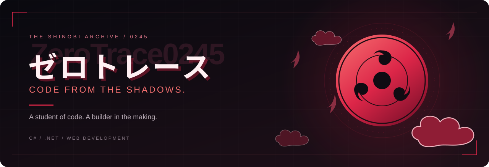
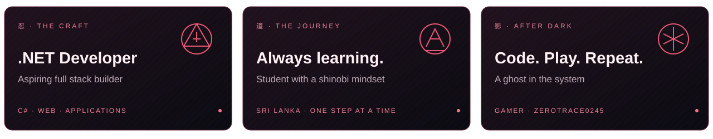
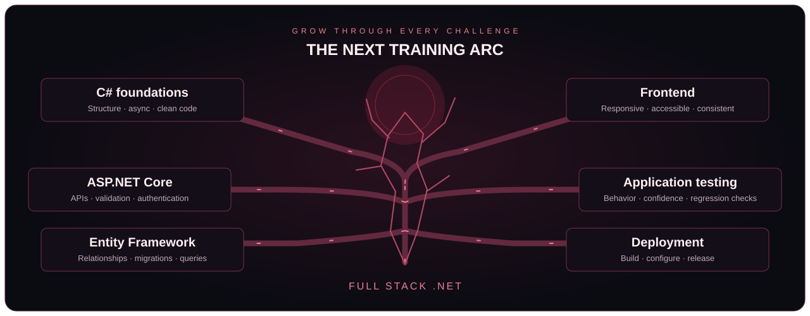

  

   

  

  # ゼロトレース

  **A ghost in the system. I play, I vanish, I win.**

  **ASPIRING FULL STACK .NET DEVELOPER · STUDENT · GAMER**

  Learning with intent. Building with patience. Leaving a trace through code.

  
  
  

  · Full stack applications · Desktop &amp; Android · Always learning

    

  [About](#01--behind-the-illusion) · [Projects](#02--mission-archive) · [Stack](#03--the-arsenal) · [Roadmap](#05--the-next-training-arc) · [Activity](#07--the-contribution-hunt) · [Connect](#09--beyond-the-shadows)

---

### 01 · Behind the illusion

I'm **ゼロトレース** - **ZeroTrace0245** on GitHub - a student turning what I learn into practical software. My mission is to become a skilled **Full Stack .NET Developer**, one project at a time.

I'm exploring how an idea becomes a complete application: the interface people interact with, the API behind it, the data it depends on, and the process of getting it running. My repositories span team collaboration, health and fitness, cultural heritage, management systems, and hardware experiments.

C# and .NET are my main direction, with JavaScript, React, Node.js, and Android projects giving me room to explore different ways of building. This profile is a record of that journey: coursework, experiments, and larger applications that help me connect the pieces.

- **Building toward** clean, efficient software that solves real problems.
- **Training in** C#, .NET, and web technologies.
- **Going deeper into** ASP.NET, Entity Framework, and REST API design.
- **Off the keyboard** gaming, recharging, and finding the next challenge.

  

## 02 · Mission archive

A selection of projects from my public repositories. Each explores a different part of application development, from full stack workflows to mobile interfaces and physical sensors.

<table>
  <tr>
    <td width="50%" valign="top">
      <h3>01 · NovaSync</h3>
      
<strong>A workspace for teams and their next move.</strong>

      
A task and collaboration platform with Kanban boards, timeline views, real-time messaging, and separate user and administrator workspaces.

      
<code>React</code> <code>Node.js</code> <code>Express</code> <code>MongoDB</code>

      
<a href="https://github.com/ZeroTrace0245/Full-Stack-Development">Explore the repository →</a>

    </td>
    <td width="50%" valign="top">
      <h3>02 · SmartBite</h3>
      
<strong>Health and fitness in one connected app.</strong>

      
A Blazor application bringing together nutrition, hydration, personal goals, pathway dashboards, and AI-assisted coaching.

      
<code>Blazor</code> <code>ASP.NET Core</code> <code>PostgreSQL</code> <code>Redis</code>

      
<a href="https://github.com/ZeroTrace0245/SmartBite">Explore the repository →</a>

    </td>
  </tr>
  <tr>
    <td width="50%" valign="top">
      <h3>03 · Digital Heritage</h3>
      
<strong>Preserving stories beyond their generation.</strong>

      
An MVP for community storytelling, artifact archives, language preservation, and cultural event mapping, backed by an ASP.NET Core REST API.

      
<code>C#</code> <code>Entity Framework Core</code> <code>SQLite</code> <code>JavaScript</code>

      
<a href="https://github.com/ZeroTrace0245/Digital-heritage-preservation-app">Explore the repository →</a>

    </td>
    <td width="50%" valign="top">
      <h3>04 · Hospital Management</h3>
      
<strong>A desktop approach to clinic administration.</strong>

      
A learning and demo project with custom WinForms controls, employee administration, database integration, and CSV export.

      
<code>C#</code> <code>WinForms</code> <code>Entity Framework Core</code> <code>SQL Server</code>

      
<a href="https://github.com/ZeroTrace0245/-hospital-management-system-using_.NET">Explore the repository →</a>

    </td>
  </tr>
  <tr>
    <td width="50%" valign="top">
      <h3>05 · Student Management</h3>
      
<strong>Student records, built for Android.</strong>

      
An Android application for adding, viewing, editing, and deleting student records, with Firestore synchronization, form validation, and Material components.

      
<code>Java</code> <code>Android</code> <code>Firebase Firestore</code>

      
<a href="https://github.com/ZeroTrace0245/Student-management-app-android-">Explore the repository →</a>

    </td>
    <td width="50%" valign="top">
      <h3>06 · Sensor Detection</h3>
      
<strong>Where software meets the physical world.</strong>

      
An Arduino sensor project exploring serial communication, live readings, and detection for limit, obstacle, ultrasonic, and pressure sensors.

      
<code>C++</code> <code>Arduino</code> <code>Serial communication</code>

      
<a href="https://github.com/ZeroTrace0245/IOT_Project">Explore the repository →</a>

    </td>
  </tr>
</table>

  **More from the archive**

  [Portfolio](https://github.com/ZeroTrace0245/My_Portfolio) · [Java project](https://github.com/ZeroTrace0245/Project_Java) · [Web coursework](https://github.com/ZeroTrace0245/WEB_LEC_GYM_WEB_SITE) · [All repositories](https://github.com/ZeroTrace0245?tab=repositories)

## 03 · The arsenal

Technologies appearing across my projects and current learning. My strongest direction is the **C# · .NET ecosystem**, with web, mobile, and hardware work broadening the picture.

#### Core languages

  
  
  
  
  
   
  
  
  
  
   
  
  
  

#### Application frameworks

  
  
  
  
  
  

#### Data and development environment

| Area | Technologies | Where they fit |
| :--- | :--- | :--- |
| .NET applications | ASP.NET Core, Blazor, WinForms | APIs, interactive web apps, and desktop interfaces |
| Data access | Entity Framework Core | Connecting C# application models to relational data |
| Relational databases | PostgreSQL, SQL Server, SQLite, MySQL | Application records, relationships, and queries |
| Document and cloud data | MongoDB, Firebase Firestore | Team workspace data and Android record synchronization |
| Caching and orchestration | Redis, .NET Aspire | Supporting services in SmartBite |
| Delivery | Git, GitHub Actions | Version history and automated workflows |
| Editors | Visual Studio, VS Code | Everyday development and project exploration |

  

## 04 · Connecting the pieces

The projects I work on cross several layers. I'm interested in understanding how those layers depend on each other and how a change in one affects the rest of an application.

**The interface** - Forms, dashboards, navigation, and feedback are where an application becomes useful to someone. My web, Blazor, WinForms, and Android projects let me explore those interactions in different environments.

**The application logic** - Behind the interface are requests, validation, state, and rules. ASP.NET Core and Node.js projects give me different ways to connect user actions to application behavior.

**The data** - Records need structure and relationships. Working across relational databases, MongoDB, and Firestore helps me explore how storage choices influence the code around them.

**The delivery** - A project also needs a way to build and run. NovaSync includes a GitHub Actions pipeline, and this profile uses a workflow to regenerate its contribution animation.

## 05 · The next training arc

  

My direction is **full stack .NET development**. These are the areas I want to deepen as I continue building, rather than a checklist of skills I've already mastered.

| Focus | What I want to strengthen |
| :--- | :--- |
| C# foundations | Clear application structure, asynchronous code, and maintainable object-oriented design |
| ASP.NET Core | API design, request validation, authentication, and useful error responses |
| Entity Framework Core | Relationships, migrations, and understanding the queries behind data access |
| Frontend development | Responsive layouts, accessible forms, and consistent loading and error states |
| Application testing | Checking important behavior and catching regressions as projects grow |
| Deployment | Repeatable builds, environment configuration, and clearer project setup instructions |

  
<strong>Open the training notes</strong>

### Build one complete flow

Start with a small feature that connects the interface, application logic, and database. Make the whole journey understandable before expanding it.

### Understand the failure paths

Look beyond the successful request: empty results, invalid input, unavailable services, and unexpected data all shape the experience.

### Return and refine

Use older projects as opportunities to improve naming, structure, documentation, and usability as my understanding develops.

### Make the work easy to explore

Keep project descriptions, setup instructions, and examples close to the code so someone else can follow the idea and try it.

## 06 · The mindset

The Itachi-inspired design brings together **quiet focus, shadows, and crimson detail**. That visual identity belongs to **ゼロトレース**; the work behind it is a growing collection of applications and experiments.

What I want my work to reflect:

- **Clarity** - code and interfaces that are easier to understand.
- **Patience** - time spent investigating a problem and learning why a fix works.
- **Purpose** - features connected to a practical task or a clear learning goal.
- **Progress** - returning to a project with better questions and stronger fundamentals.

  **Learn the pattern. Understand the system. Build the next version.**

  

## 07 · The contribution hunt

Every contribution feeds the next move. A crimson snake retraces my GitHub activity, refreshed daily.

  <picture>
    <source media="(prefers-color-scheme: dark)" srcset="https://raw.githubusercontent.com/ZeroTrace0245/ZeroTrace0245/output/github-snake-dark.svg" />
    <source media="(prefers-color-scheme: light)" srcset="https://raw.githubusercontent.com/ZeroTrace0245/ZeroTrace0245/output/github-snake.svg" />
    
  </picture>

  

The grid is a small window into the activity behind these repositories. Open the [contribution history](https://github.com/ZeroTrace0245?tab=overview) to explore the work, or browse the [project archive](https://github.com/ZeroTrace0245?tab=repositories) for the code and documentation.

## 08 · When the screen goes quiet

I'm a **gamer at heart**. Beyond application development, gaming is another part of the ZeroTrace identity — a different kind of challenge after time spent with code.

The name **ゼロトレース** takes the spotlight here, with the English handle fading into the shadows. Crimson accents, the Sharingan moon, and Akatsuki-inspired clouds carry that identity through the profile.

  **Code by day. Game by night.**

  

## 09 · Beyond the shadows

If a project catches your attention, its repository is the best place to start. Explore the source, read the setup notes, or use its Issues tab to share a specific question or suggestion.

| Find me | What you'll find |
| :--- | :--- |
| [GitHub · ZeroTrace0245](https://github.com/ZeroTrace0245) | My public development profile and contribution history |
| [Project repositories](https://github.com/ZeroTrace0245?tab=repositories) | Applications, experiments, coursework, and documentation |
| [Portfolio source](https://github.com/ZeroTrace0245/My_Portfolio) | My portfolio repository |
| [Steam · ゼロトレース](https://steamcommunity.com/profiles/76561199213792988/) | The gaming side of ZeroTrace |

---

  ### ゼロトレース

  **Quiet focus. Steady progress.**

  with curiosity - one project, one lesson, one commit at a time.

  Visual theme inspired by Itachi Uchiha · Naruto

    
  

